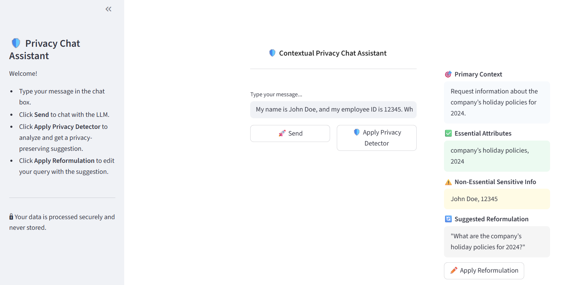

# Contextual Privacy Chat Assistant

A Streamlit-based demo that lets users chat with an LLM (Large Language Model) while providing real-time privacy analysis and query reformulation suggestions. The app helps users identify and minimize sensitive information in their queries before sending them to the LLM.

---

**This project is inspired by the ideas presented in the paper:  
["Protecting Users From Themselves: Safeguarding Contextual Privacy in Interactions with Conversational Agents"](https://arxiv.org/pdf/2502.18509)**

---

## Demo Screenshot



---

## Features

- **Chat Interface:**  
  Chat with an LLM in a familiar, conversational UI.

- **Privacy Detector:**  
  Analyze your query for primary context, essential attributes, and non-essential sensitive information.

- **Reformulation Suggestions:**  
  Get privacy-preserving reformulations of your queries.

---

## Setup

1. **Set your DeepSeek API key:**
    ```bash
    export DEEPSEEK_API_KEY=your_deepseek_api_key
    ```

2. **Run the app:**
    ```bash
    streamlit run main.py
    ```

---

## File Structure

```
sensitive-info-detector/
│
├── main.py
├── llm_utils.py
├── ui_components.py
├── prompts.py
├── style.py
```

---

## Customization

- **Change the LLM model:**  
  Edit the model name in `llm_utils.py`.
- **Modify prompts:**  
  Edit `prompts.py` for your own privacy analysis or reformulation instructions.
- **UI tweaks:**  
  Adjust layout and styles in `ui_components.py` and `style.py`.

---

## License

MIT License

---

## Credits

Powered by Copilot
